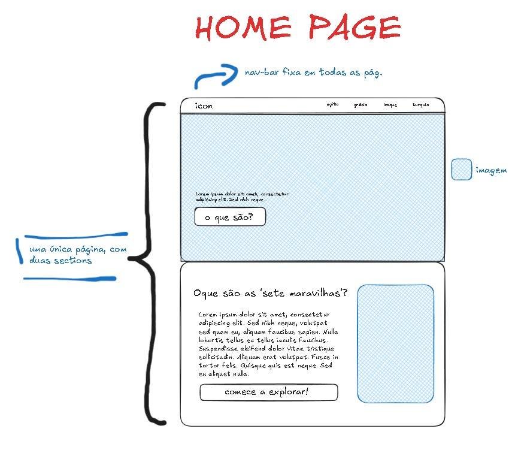
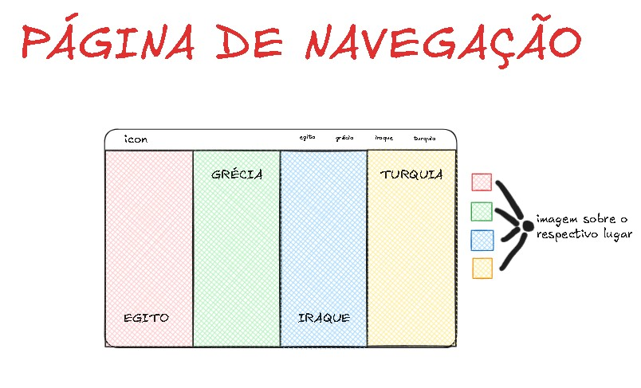
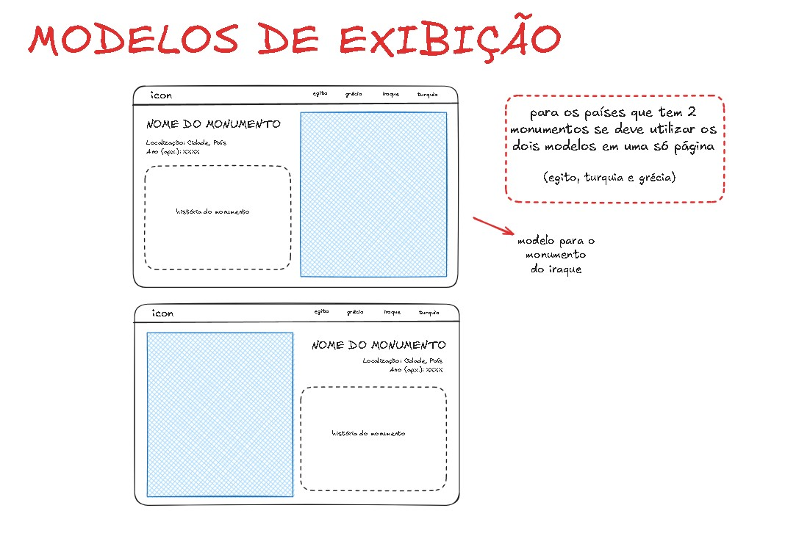

# MARKDOWN

---
## Quais são as regras para aplicar no CSS?
  - Como serão os nomes?
    - Padrão (Primário, Secundário, Terciário, etc..)
  - Vai usar alguma pattern CSS? Consulte na net sobre BEM CSS.
    - Não
  - Serão utilizadas as cores com qual nomeclatura?
    - Hexadecimal
  - Será utilizado bootstrap ou css puro?
    - css puro
  - Quais as unidades utilizadas?
    - Texto: rem
    - Divs: %
    
  - Será utilizado :root{ }?
    - Sim
  - Comentários?
    - Não
  - Espaços em branco ou tabs para indentação?
    - Tabs
  - Quais são as regras para criar em javascript:
    - Variáveis
    - Funções
    - Classes
    - Objetos
    - Comentários?
    - Como será o evento de clique do javascript? direto no html  com onclick ou pelo addEventListener?
      - onClick
- Como o HTML será estruturado?
    - Vai utilizar < br >?
        - Não
    - Vai utiilzar layout fixo ou fluido? 
      - Fluído
    - Quais serão os breakpoints responsivos utilizados? O layout ficará responsivo somente na transição de tela entre mobile e desktop? ou vai abranger outro tamanho de tela?
      - apenas mobile e desktop
---
# WireFrame para o desenvolvimento

root pra uso das cores:

:root{
    --cor-fundo: #F2E2C4; //background
    --cor-primaria: #BFA380; //cabeçalho nessa cor
    --cor-secundaria: #734226; //outlines
    --cor-destaque:  #8C5B30; //títulos como h1 nessa cor
    --cor-texto: #261F16 //texto nesssa cor
}

